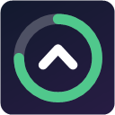
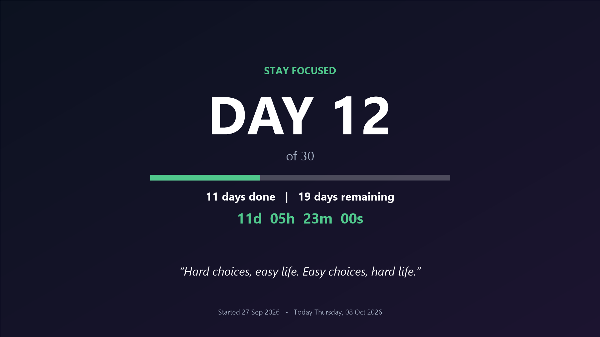
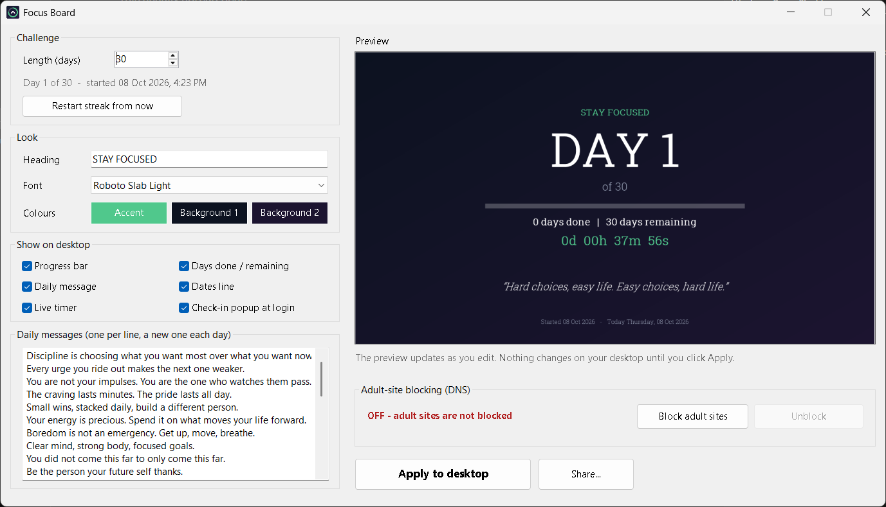

<h1 align="center">Focus Board</h1>

<b>A habit-streak tracker that lives on your Windows desktop.</b> 
Day count, progress bar, a new motivational message every day and a live streak timer - painted right onto your wallpaper, so you see it every time you sit down.

## Why

Willpower is easier when your goal is in front of you. Focus Board turns your desktop into a quiet daily reminder of the promise you made to yourself - quitting a bad habit, building a good one, or any personal challenge.

It's neutral by design: the screen says things like **"STAY FOCUSED"**, never what the challenge is about, so it's fine on a shared computer.

## Features

- **Daily wallpaper** - "Day 12 of 30", progress bar, days done / remaining, refreshed every midnight.
- **Live streak timer** - ticks every second on the desktop (`11d 05h 23m 00s`), sits behind your apps, survives Win+D.
- **New message every day** - comes with 30 built in; write your own.
- **Design it yourself** - heading, font, colours, and what's shown, with a live preview.
- **Daily check-in** - a short "Still on track?" at login. Slipped? Restart the streak in one click - no judgement.
- **Optional adult-site blocker** - one button switches the PC to [Cloudflare for Families](https://blog.cloudflare.com/introducing-1-1-1-1-for-families/) DNS and stops browsers bypassing it with their own secure DNS. Turning it off asks you to pause and type a sentence first.
- **Private** - no account, no internet service of its own, no data collected. Everything stays in its folder on your PC.

## Install

**Requirements:** Windows 10 or 11. Nothing else - it uses PowerShell and .NET, which come with Windows.

1. Download **FocusBoard.zip** from the [latest release](../../releases/latest).
2. Right-click it > **Extract All**, and move the `FocusBoard` folder somewhere permanent (e.g. Documents - not Downloads; the app runs from this folder).
3. Double-click **`install.bat`**.
   If you see *"Windows protected your PC"*, click **More info > Run anyway**. Windows shows this for any app that isn't code-signed by a known publisher; the full source is right here for you to read.
4. Focus Board opens - set your challenge length and design, then click **Apply to desktop**.

A **Focus Board** icon appears on your desktop, and the wallpaper, timer and check-in start automatically at every login.

## Uninstall

Right-click `uninstall.ps1` > **Run with PowerShell**. It removes the desktop icon, autostart entries, the daily task and the timer. (If you turned blocking on, click **Unblock** in the app first.)

## How it works

| File | What it does |
|---|---|
| `focus-board.ps1` | The designer app (the desktop icon opens this) |
| `update-wallpaper.ps1` | Draws today's wallpaper; at login also shows the check-in |
| `timer-widget.ps1` | The live timer on the desktop |
| `dns-block.ps1` | Turns adult-site blocking on/off (runs as admin when you click the button) |
| `common.ps1` | Shared settings and drawing code |
| `setup.ps1` / `install.bat` | Installs the desktop icon, login autostart and a daily refresh task |

Your settings live in `config.json` and your messages in `quotes.txt`, next to the scripts.

## Limits

The blocker is a strong speed bump, not a lock: a VPN, another network adapter, or anyone with admin rights can get around it.

## License

[MIT](LICENSE) - free to use, change and share.
